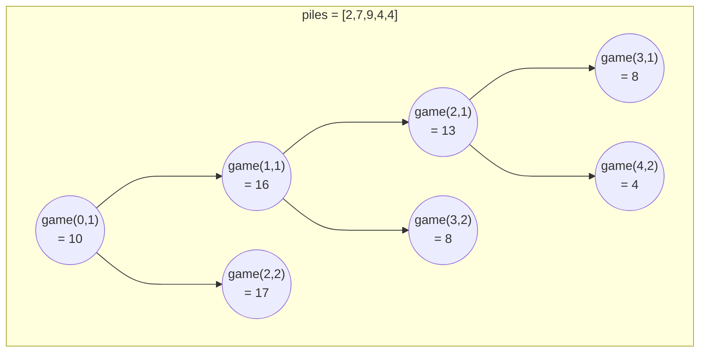

# Stone Game II

This problem can be solved using Dynamic Programming.

You can think of this problem as given current position, `i` and `m`, trying all possible `x` in range `1 <= x <= m` and find maximum score.

For example, given `piles = [2,7,9,4,4]`,

Alex can take either `1` or `2` piles and after Lee picks up his stones, Alex can again choose either `1` or `2` piles and the game goes on until the end of the pile.

The problem says we should find out maximal score for Alex therefore Lee's score should be minimized.

This can be expressed as `suffix_sum[i] - min_score` where `min_score` refers to Lee's score and `suffix_sum` refers to `sum of piles starting from i`.

Now we can define recursive function as `game(i, m)` where `i` = current position.

given `piles = [2,7,9,4,4]`, recursive calls can be visualized as follows



Then what about the implementation of the function `game`?

```python
@lru_cache(None)
def game(i, m):

    # this means one can take every stones, i.e. end of the game
    if i + 2 * m >= len(piles):
        return suffix_sum[i]
    
    min_score = 2 ** 31 - 1
    
    # as range of x equals 1 <= x <= m
    # we should test every possible value of x
    for x in range(1, 2 * m + 1):

        # next game starts here
        next_start = i + x
        next_m = max(x, m)

        score = game(next_start, next_m)
        min_score = min(score, min_score)

    return suffix_sum[i] - min_score
```

For complete solution, see `solution.py`.
